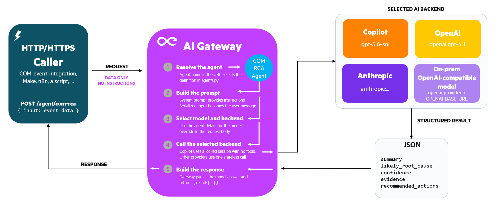

# AI Gateway

The AI Gateway gives applications one private HTTP or HTTPS endpoint for
running named AI agents. It keeps model credentials and instructions out of the
calling application, and can use GitHub Copilot, OpenAI, Anthropic, or a
customer-hosted OpenAI-compatible model.

It is designed for operators and customers. Use the published container image;
no source checkout or image build is required for deployment.

## Contents

- [What it does](#what-it-does)
- [Available agents](#available-agents)
- [Quick Start](#quick-start)
- [Configuration](#configuration)
- [API](#api)
- [Security](#security)
- [Run locally](#run-locally)
- [HPE COM integration](#hpe-com-integration)
- [Automation integrations](#automation-integrations)
- [Operator Guide](#operator-guide)

## What it does

1. Receives application data at `/agent/{name}`.
2. Applies the selected agent's instructions.
3. Sends the request to the configured AI backend.
4. Returns the model result as JSON when the model provides JSON.



Supported backend options:

- GitHub Copilot
- OpenAI
- Anthropic
- An external on-prem OpenAI-compatible Chat Completions service

The gateway is backend-neutral. The HPE COM bridge and shim are supported
callers, and any HTTP client or automation platform can use the same endpoint
contract. Examples include n8n, Zapier, and Make.

Multiple gateway containers can run behind a load balancer. This works directly
for the stateless OpenAI-compatible and Anthropic providers. For Copilot
requests that use a persistent `session_id`, configure session affinity so the
same conversation consistently reaches the same gateway replica.

## HPE COM integration

The AI Gateway integrates with the public
[HPE-COM-Event-Integrations](https://github.com/jullienl/HPE-COM-Event-Integrations)
project. Its bridge and shim can send Compute Ops Management events and related
server evidence to the `com-rca` agent, then place the analysis in the target
ticket or notification.

See the [HPE COM analyzer setup](https://github.com/jullienl/HPE-COM-Event-Integrations/blob/main/com-event-core/README.md#set-up-the-analyzer)
for integration configuration and deployment options.

## Available agents

| Agent | Purpose |
| --- | --- |
| `com-triage` | Classifies a COM event and identifies whether deeper analysis is needed. |
| `com-rca` | Produces a root-cause analysis from the event and supplied evidence. |
| `com-remediation` | Produces an ordered remediation plan with risks and rollback guidance. |
| `com-summary` | Produces a short human-readable summary. |

The running gateway is the source of truth for the configured list:

```bash
curl http://localhost:8000/agents
```

The agent name is part of the request URL, for example `POST /agent/com-rca`.

## Quick Start

The published image is available from GHCR:

```text
ghcr.io/jullienl/ai-gateway:1.0.2
```

This example uses release `1.0.2`. The published package is public and can be
pulled directly from GHCR.

### Run with Docker

The example below uses GitHub Copilot. Configure a different backend with the
environment variables in [Configuration](#configuration).

```bash
docker pull ghcr.io/jullienl/ai-gateway:1.0.2

docker run -d --name ai-gateway -p 8000:8000 \
  -v /run/secrets/copilot_pat:/run/secrets/copilot_pat:ro \
  -e COPILOT_GITHUB_TOKEN_FILE=/run/secrets/copilot_pat \
  ghcr.io/jullienl/ai-gateway:1.0.2
```

Keep credentials in mounted secret files where possible. Do not bake secrets
into an image or commit them to a repository.

### Docker Compose

```yaml
services:
  ai-gateway:
    image: ghcr.io/jullienl/ai-gateway:1.0.2
    ports:
      - "8000:8000"
    environment:
      COPILOT_GITHUB_TOKEN_FILE: /run/secrets/copilot_pat
    secrets:
      - copilot_pat

secrets:
  copilot_pat:
    file: ./copilot-pat.txt
```

```bash
docker compose up -d
```

## Configuration

### OpenAI-compatible on-prem model

Set the default provider to `openai` and point it at the customer's model
server:

```text
AI_PROVIDER=openai
OPENAI_BASE_URL=https://model-server.example.com/v1
OPENAI_API_KEY_FILE=/run/secrets/model_api_key
```

The server must implement `/v1/chat/completions` and be reachable from the
gateway. HTTP is suitable only for localhost or an isolated trusted private
network. Use HTTPS for shared or untrusted paths. For a private certificate
authority, set `SSL_CERT_FILE` to a merged bundle containing private and public
roots.

The model name is selected in the request, for example:

```json
{
  "model": "openai:customer-model",
  "input": {
    "event": {
      "title": "Example event"
    }
  }
}
```

### Credentials

Secrets support a file-first pattern:

| Backend | Credential |
| --- | --- |
| Copilot | `COPILOT_GITHUB_TOKEN_FILE` or `COPILOT_GITHUB_TOKEN` |
| OpenAI or on-prem OpenAI-compatible | `OPENAI_API_KEY_FILE` or `OPENAI_API_KEY` |
| Anthropic | `ANTHROPIC_API_KEY_FILE` or `ANTHROPIC_API_KEY` |

Use `AI_PROVIDER=openai` for a customer-hosted OpenAI-compatible service.
Valid default providers are `copilot`, `openai`, and `anthropic`.

## API

### Where prompts live

The gateway owns the system prompt for each named agent. Callers send event
data and evidence as `input`; they do not need to send the agent instructions.
The configured prompt is applied by the gateway before the request is sent to
the selected backend. This keeps prompt changes and model credentials out of
the calling application.

### Health check

```bash
curl http://localhost:8000/health
```

### Run an agent

```bash
curl -X POST http://localhost:8000/agent/com-rca \
  -H "Content-Type: application/json" \
  -d '{"input":{"event":{"title":"Example event"}}}'
```

The `com-rca` result uses these fields when the selected model returns valid
structured output:

```text
summary
likely_root_cause
evidence
confidence
recommended_actions
```

### Caller authentication

The gateway does not authenticate callers itself. Run it on a private network,
use internal ingress, or place it behind an authenticated reverse proxy. Do not
expose an unauthenticated gateway directly to the internet.

### Security

The gateway does not authenticate callers itself. Anyone who can reach it may
use the configured model quota. Use a private network or internal ingress, and
put an authenticated reverse proxy in front of it when callers are not already
trusted. Keep provider credentials in mounted secret files and do not include
event data that the selected model service is not permitted to receive.

Requests are limited to 1 MB by default. The gateway does not give models
filesystem, shell, or source-control tools.

## Run locally

For a quick local check without a model service, use the development mock:

```powershell
python -m dev.mock_openai_server
```

In another terminal, run the gateway from the repository checkout:

```powershell
$env:AI_PROVIDER = "openai"
$env:OPENAI_BASE_URL = "http://127.0.0.1:11434/v1"
$env:OPENAI_API_KEY = "test-key"
python -m uvicorn app:app --host 127.0.0.1 --port 8000
```

This mock is for development/testing only. For customer deployment, use the
published container image described above.

## HPE COM integration

The HPE COM bridge and shim can use the gateway as their AI analyzer. Configure
their `AI_ANALYZER_URL` to the gateway URL and select the `com-rca` agent. See
the [COM event analyzer setup](https://github.com/jullienl/HPE-COM-Event-Integrations/blob/main/com-event-core/README.md#set-up-the-analyzer)
for the integration-specific configuration.

## Automation integrations

n8n, Zapier, Make, and other automation platforms can call the same
`POST /agent/{name}` endpoint with an HTTP request action. The gateway does not
require a particular automation platform, and the workflow does not need model
credentials.

## Operator Guide

For deployment, TLS, secret files, Azure Container Apps, multi-tenant Copilot
configuration, troubleshooting, and optional integrations, see
[GUIDE.md](GUIDE.md).
